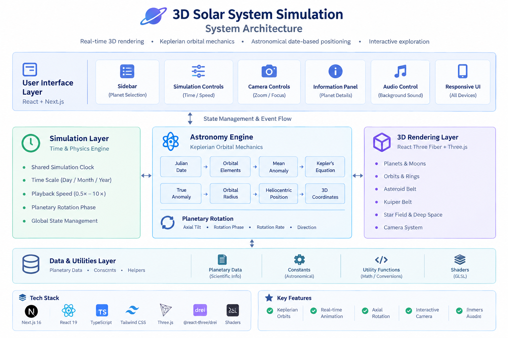

# 🌌 3D Solar System Simulation

An interactive **3D Solar System Simulation** built with **Next.js, React, TypeScript, Three.js, and React Three Fiber**.

The project combines real-time 3D rendering with a **Keplerian orbital mechanics-based model** to visualize approximate planetary motion and rotation in an immersive browser-based environment.

## 🚀 Demo

🌐 **[Live Demo](https://3-d-solar-system-simulation-gilt.vercel.app/)**
💻 **[GitHub Repository](https://github.com/akshuvo101/3D-Solar-System-Simulation)**

## 🖼️ Preview


## ✨ Key Features

* 🌍 Interactive 3D Solar System with Sun and eight planets
* 🪐 Keplerian orbital mechanics-based planetary positioning
* 📅 Current UTC date/time as the simulation reference
* 🔄 Planet-specific axial rotation and rotation rates
* ⏱️ Day / Month / Year simulation modes
* ⚡ Adjustable playback speed from `0.5×` to `10×`
* 🎥 Interactive camera controls and selected-planet tracking
* 🌌 Procedural deep-space environment and distributed star field
* ☄️ Asteroid Belt and Kuiper Belt visualization
* 🪐 Procedural planetary ring systems
* 🎨 Custom GLSL shaders and procedural planetary surfaces
* 🌫️ Atmospheric, cloud, crater, storm, and terrain effects
* 📊 Scientific planet information
* 🎵 Ambient background audio
* 📱 Responsive astronomy-inspired interface

## 🧠 Astronomy & Simulation

The planetary motion system uses a simplified **Keplerian orbital mechanics model** rather than fixed circular animation.

The calculation flow is:

```text
UTC Date/Time
      ↓
Julian Date
      ↓
Days Since J2000.0
      ↓
Orbital Elements
      ↓
Mean Anomaly
      ↓
Kepler's Equation
      ↓
True Anomaly
      ↓
Orbital Radius
      ↓
Heliocentric Coordinates
      ↓
Three.js 3D Position
```

Planetary rotation is independently calculated from J2000.0-based rotation parameters, including axial tilt, rotation phase, rotation rate, and rotation direction.

A shared simulation clock synchronizes orbital motion and planetary rotation.

## 🏗️ Architecture

The application separates the **simulation layer**, **astronomical calculations**, **3D rendering**, and **user interface** into focused components.



### Core Architecture

```text
Next.js Application
        │
        ├── UI & Controls
        │
        ├── Simulation Clock
        │
        ├── Astronomy Engine
        │      ├── Julian Date
        │      ├── Orbital Elements
        │      ├── Kepler Solver
        │      └── Planetary Position
        │
        └── React Three Fiber
               ├── Planets
               ├── Moons
               ├── Orbits
               ├── Star Field
               ├── Asteroid Belt
               ├── Kuiper Belt
               └── Camera System
```

## 🛠️ Tech Stack

| Category     | Technologies          |
| ------------ | --------------------- |
| Framework    | Next.js 16            |
| UI           | React 19, TypeScript  |
| Styling      | Tailwind CSS          |
| 3D Rendering | Three.js              |
| React 3D     | React Three Fiber     |
| 3D Utilities | @react-three/drei     |
| Graphics     | GLSL / Custom Shaders |
| Icons        | Lucide React          |
| Code Quality | ESLint                |

## 🎮 Controls

| Action             | Control                |
| ------------------ | ---------------------- |
| Select planet      | Sidebar / Click planet |
| Rotate camera      | Mouse drag             |
| Zoom               | Mouse wheel            |
| Quick zoom         | On-screen controls     |
| Simulation time    | Day / Month / Year     |
| Playback speed     | `0.5×` – `10×`         |
| Planet information | Information panel      |
| Background audio   | Music control          |

## 📦 Getting Started

### Prerequisites

* Node.js 18+
* npm

### Installation

```bash
git clone https://github.com/akshuvo101/3D-Solar-System-Simulation.git
cd 3D-Solar-System-Simulation
npm install
```

### Development

```bash
npm run dev
```

Open `http://localhost:3000` in your browser.

### Production Build

```bash
npm run build
npm run start
```

### Lint

```bash
npm run lint
```

## ⚠️ Simulation Accuracy

This project is intended as an **educational and engineering-level visualization**.

Planetary positions are calculated using a **Keplerian orbital mechanics approximation** based on orbital elements and the J2000.0 reference epoch.

The model is **not a high-precision NASA/JPL ephemeris implementation**. Small differences from actual planetary positions are therefore expected.

## 🔮 Roadmap

* 🌙 Improved Moon orbital systems
* 🚀 Spacecraft and satellite simulation
* ☄️ Comet and dwarf-planet systems
* 🔭 Telescope exploration mode
* 📈 Advanced astronomical data visualization
* 🔬 Higher-precision ephemeris support
* 🎮 Expanded exploration and interaction features

## 👨‍💻 Developer

**AK Shuvo**

Full-Stack Web Developer

**Focus:** Next.js • React • TypeScript • Three.js • Supabase

---

⭐ If you find this project interesting, consider giving the repository a star.

## 📄 License

**Proprietary — All Rights Reserved**

Copyright (c) 2026 AK Shuvo.

This project and its source code are proprietary. Unauthorized copying,
modification, redistribution, sublicensing, or commercial use of the
source code is not permitted without prior written permission.

The live demo is publicly accessible for viewing and evaluation. Access
to the live application does not grant any rights to the underlying
source code.

See the [LICENSE](./LICENSE) file for the complete terms.