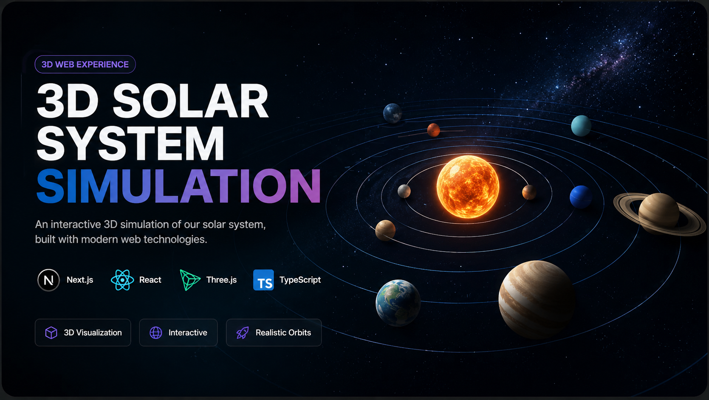

# 🌌 3D Solar System Simulation

An interactive and immersive **3D Solar System Simulation** built with **Next.js, React, TypeScript, Three.js, and React Three Fiber**.

Explore the Solar System through interactive 3D planetary motion, Keplerian orbital mechanics, astronomical date-based positioning, planetary axial rotation, custom shader effects, deep-space environments, asteroid and Kuiper belts, detailed planet information, camera controls, and ambient audio.

---

## 🚀 Live Demo

🌐 **[Launch the 3D Solar System Simulation](https://3-d-solar-system-simulation-gilt.vercel.app/)**

💻 **[View Source Code on GitHub](https://github.com/akshuvo101/3D-Solar-System-Simulation)**

---

## 🖼️ Preview



---

## ✨ Features

### 🌍 Interactive 3D Solar System

* Explore the Sun and all eight planets in an interactive 3D environment.
* Freely navigate around the Solar System.
* Select planets from the sidebar or directly from the 3D scene.
* View detailed scientific information for individual planets.
* Explore planetary systems from different camera angles.

---

### 🪐 Astronomy-Based Planetary Motion

The simulation uses a **Keplerian orbital mechanics-based planetary position model** to calculate approximate heliocentric planetary positions.

The astronomical calculation pipeline includes:

* Julian Date calculation
* J2000.0 reference epoch
* Planetary orbital elements
* Mean anomaly calculation
* Kepler's equation
* Eccentric anomaly
* True anomaly
* Orbital radius calculation
* Orbital-plane to ecliptic coordinate transformation
* Heliocentric 3D positioning

Planetary positions are calculated from the simulation's astronomical date/time rather than relying on a fixed visual starting angle.

> **Note:** The orbital model is an educational and engineering-level approximation based on Keplerian orbital mechanics. It is not intended to reproduce high-precision NASA/JPL ephemeris calculations.

---

### ⏱️ Real-Time Simulation Clock

The simulation uses a shared astronomical simulation clock to control planetary motion.

The initial simulation time is based on the **current UTC date and time**.

This allows the system to:

* Initialize planetary positions from the current date/time.
* Advance the astronomical simulation continuously.
* Change simulation time using different time scales.
* Synchronize orbital motion and planetary rotation.
* Recalculate planetary positions as simulation time progresses.

The real-world date/time acts as the starting reference instead of storing a previous planetary position in browser storage.

---

### ⚡ Simulation Modes

The simulation provides three different astronomical time scales:

* **1 Day**
* **1 Month**
* **1 Year**

These modes control how quickly the simulated astronomical date advances.

Playback speed can also be adjusted using:

* `0.5×`
* `1×`
* `2×`
* `5×`
* `10×`

This provides both slow exploration and accelerated Solar System evolution.

---

### 🔄 Planetary Axial Rotation

The planets also rotate around their own axes using astronomical rotation parameters.

The implementation includes:

* Planet-specific axial tilt
* Planet-specific rotation phase
* Planet-specific rotation rate
* Prograde and retrograde rotation
* J2000.0-based rotation phase
* Continuous rotation synchronized with simulation time

The rotation system supports different rotational behaviors for planets such as Venus and Uranus instead of applying the same generic rotation speed to every planet.

---

### 🎯 Planet Selection

Select any major Solar System body from the interface:

* ☀️ Sun
* ☿ Mercury
* ♀ Venus
* 🌍 Earth
* ♂ Mars
* ♃ Jupiter
* ♄ Saturn
* ♅ Uranus
* ♆ Neptune

Planets can be selected from the sidebar or directly from the 3D scene.

Selecting a planet updates the corresponding information and camera focus.

---

### 📊 Planet Information

The application provides scientific information about individual planets, including:

* Radius
* Mass
* Gravity
* Temperature
* Rotation period
* Orbital period
* Moon count
* Day length
* Year length
* Planet type
* Additional astronomical facts

The information panel is integrated with the interactive 3D experience.

---

## 🎥 Camera & Navigation

The simulation includes an interactive camera system powered by Three.js and React Three Fiber.

Features include:

* Interactive `OrbitControls`
* Free camera rotation
* Mouse-wheel zoom
* On-screen zoom controls
* Selected-planet focus
* Smooth camera tracking
* Cinematic camera movement
* Planet-following behavior
* Interactive exploration from different angles

The camera system is designed to allow users to inspect planets while maintaining free control over the scene.

---

## 🌌 Deep Space Environment

The Solar System is surrounded by a procedural deep-space environment designed to make the simulation feel more immersive.

Environmental elements include:

### ⭐ Dynamic Star Field

A procedural star field provides a large-scale background filled with distributed stars.

### ☄️ Asteroid Belt

A procedural asteroid belt is positioned between Mars and Jupiter.

It includes:

* Instanced asteroid rendering
* Large numbers of asteroid objects
* Rocky procedural appearance
* Dust-like environmental details
* Featured asteroid objects
* Optimized rendering using instancing

### 🧊 Kuiper Belt

A second outer belt represents the distant Kuiper Belt region beyond Neptune.

It provides additional depth and scale to the Solar System environment.

### 🌑 Deep Space

The environment also includes:

* Deep-space background
* Space lighting
* Atmospheric effects
* Star particles
* Distant celestial ambience

---

## 🪐 Planetary Rings

Ring systems are included for the outer planets where appropriate.

The ring systems use dedicated procedural materials and layered geometry to create:

* Multiple ring bands
* Radial divisions
* Darker ring gaps
* Dust-like structures
* Layered ring appearance

Ring systems are integrated with the planetary hierarchy so they follow the planet's orientation and rotational system.

---

## 🎨 Custom Shader Effects

The project uses custom **GLSL shader materials** to create procedural planetary and environmental effects.

Shader-based visuals are used for:

* Planetary surfaces
* Atmospheric layers
* Cloud structures
* Planetary bands
* Craters
* Terrain variation
* Storm systems
* Polar regions
* Space environments
* Planetary rings
* Lighting and terminator effects

Several planets use spherical 3D procedural noise rather than simple UV-based surface noise to reduce visible texture seams and improve the appearance of planetary surfaces.

---

## 🌍 Planet-Specific Visual Systems

Each major planet has its own visual treatment rather than using one generic planetary material.

Examples include:

### ☿ Mercury

* Procedural rocky terrain
* Multiple crater scales
* Regolith variation
* High-contrast surface details
* Terminator and night-side shading

### ♀ Venus

* Dense atmospheric appearance
* Procedural cloud structures
* Atmospheric bands
* Retrograde rotation
* Layered cloud effects

### 🌍 Earth

* Procedural terrain variation
* Cloud layer
* Atmospheric shell
* Day/night lighting
* Terminator shading
* Limb effects

### ♂ Mars

* Procedural rocky terrain
* Large and small crater structures
* Polar regions
* Dust and atmospheric haze
* Terrain variation

### ♃ Jupiter

* Atmospheric bands
* Turbulent cloud structures
* Great Red Spot
* Polar atmospheric effects
* Fine-scale cloud detail

### ♄ Saturn

* Golden atmospheric bands
* Turbulent cloud structures
* Polar effects
* Procedural surface detail
* Multi-layer ring system

### ♅ Uranus

* Cyan/icy atmospheric appearance
* Subtle atmospheric bands
* Polar effects
* Fine cloud structures
* Multi-layer ring system

### ♆ Neptune

* Deep blue atmospheric appearance
* Atmospheric bands
* Storm structures
* High-altitude clouds
* Polar effects
* Procedural ring system

---

## 🎵 Ambient Audio

The simulation includes an optional immersive audio system.

Features include:

* Background space ambience
* Audio toggle
* Planet-related audio support
* Ambient sound while exploring the Solar System

Audio can be enabled or disabled through the interface.

---

## 📱 Responsive UI

The application uses a modern astronomy-inspired interface designed to work across different screen sizes.

The interface includes:

* Planet sidebar
* Planet information panel
* Simulation controls
* Time-scale controls
* Playback speed controls
* Camera controls
* Zoom controls
* Audio controls
* Responsive layouts

The 3D scene remains the primary focus while interface elements provide access to the simulation controls and scientific information.

---

## 🧭 Controls

| Action                  | Control                |
| ----------------------- | ---------------------- |
| Select planet           | Sidebar                |
| Select planet directly  | Click a planet         |
| Rotate camera           | Mouse drag             |
| Zoom                    | Mouse wheel            |
| Quick zoom              | On-screen zoom buttons |
| Change simulation time  | Day / Month / Year     |
| Adjust playback speed   | Speed controls         |
| Focus selected planet   | Planet selection       |
| Toggle background audio | Music button           |
| View planet information | Information panel      |

---

## 🧠 Astronomy Calculation Architecture

The planetary positioning system follows a simplified orbital mechanics pipeline:

```text
Current UTC Date/Time
        ↓
Julian Date
        ↓
Days Since J2000.0
        ↓
Orbital Elements
        ↓
Mean Anomaly
        ↓
Kepler's Equation
        ↓
Eccentric Anomaly
        ↓
True Anomaly
        ↓
Orbital Radius
        ↓
Heliocentric Coordinates
        ↓
Three.js 3D Position
```

Planetary rotation follows a separate synchronized calculation:

```text
Simulation Date
      ↓
Days Since J2000.0
      ↓
Rotation Phase
      ↓
Rotation Rate
      ↓
Axial Tilt
      ↓
Planet Orientation
```

Both systems use the shared simulation clock so that orbital motion and axial rotation advance together.

---

## 📁 Project Structure

```text
3D-Solar-System-Simulation/
│
├── app/
│   ├── page.tsx
│   └── simulation/
│       └── page.tsx
│
├── components/
│   ├── common/
│   │   ├── AudioPlayer.tsx
│   │   └── PlanetInfo.tsx
│   │
│   ├── layout/
│   │   └── Sidebar.tsx
│   │
│   ├── solar/
│   │   ├── SolarSystem3D.tsx
│   │   ├── Planet.tsx
│   │   ├── Sun.tsx
│   │   ├── Moon.tsx
│   │   ├── StarField.tsx
│   │   ├── DeepSpace.tsx
│   │   ├── AsteroidBelt.tsx
│   │   ├── KuiperBelt.tsx
│   │   ├── OrbitPath.tsx
│   │   ├── CameraController.tsx
│   │   ├── CinematicController.tsx
│   │   └── ZoomControls.tsx
│   │
│   └── ui/
│       └── Button.tsx
│
├── hooks/
│   └── ...
│
├── lib/
│   ├── astronomy/
│   │   ├── julianDate.ts
│   │   ├── orbitalElements.ts
│   │   ├── kepler.ts
│   │   ├── planetaryPosition.ts
│   │   └── rotationPhase.ts
│   │
│   ├── planetData.ts
│   ├── constants.ts
│   └── simulationTime.ts
│
├── shaders/
│   └── ...
│
├── types/
│   └── ...
│
├── public/
│   ├── images/
│   │   └── 3d-solar.png
│   └── textures/
│       └── ...
│
├── package.json
├── tsconfig.json
├── next.config.ts
└── README.md
```

---

## 🛠️ Technology Stack

### Frontend

* **Next.js 16**
* **React 19**
* **TypeScript**
* **Tailwind CSS**

### 3D & Graphics

* **Three.js**
* **React Three Fiber**
* **@react-three/drei**
* **GLSL / Custom Shader Materials**

### UI & Development

* **Lucide React**
* **ESLint**

---

## 📦 Installation

Clone the repository:

```bash
git clone https://github.com/akshuvo101/3D-Solar-System-Simulation.git
```

Navigate to the project directory:

```bash
cd 3D-Solar-System-Simulation
```

Install dependencies:

```bash
npm install
```

---

## ▶️ Run Locally

Start the development server:

```bash
npm run dev
```

Then open:

```text
http://localhost:3000
```

---

## 🔧 Available Scripts

### Development

```bash
npm run dev
```

Starts the Next.js development server.

### Production Build

```bash
npm run build
```

Creates an optimized production build.

### Production Server

```bash
npm run start
```

Starts the application in production mode.

### Lint

```bash
npm run lint
```

Runs ESLint to check the codebase.

---

## 🌠 About the Project

This project was created to explore the combination of **modern web development, astronomy, real-time 3D graphics, and interactive simulation**.

It demonstrates how a modern Next.js application can be combined with Three.js and React Three Fiber to create an interactive astronomical environment directly in the browser.

The project focuses on:

* Real-time 3D rendering
* Keplerian orbital mechanics
* Astronomical date/time calculations
* Planetary axial rotation
* Planet selection and interaction
* Camera tracking and navigation
* Custom GLSL shaders
* Procedural planetary surfaces
* Procedural space environments
* Instanced 3D objects
* Asteroid and Kuiper belts
* Scientific data presentation
* Responsive UI design
* Immersive audio

The goal is to provide an engaging way to explore the Solar System while demonstrating practical techniques for building complex real-time 3D applications on the web.

---

## 🧠 What I Learned

Through this project, I explored and implemented:

* React Three Fiber scene architecture
* Three.js object and camera management
* Real-time animation with `useFrame`
* Shared simulation clock architecture
* Julian Date calculations
* J2000.0 astronomical reference systems
* Keplerian orbital mechanics
* Kepler's equation
* True anomaly and eccentric anomaly calculations
* Heliocentric coordinate transformations
* Planetary axial rotation
* Planet-specific rotation rates
* Retrograde planetary rotation
* Interactive 3D object selection
* Camera tracking and OrbitControls
* Cinematic camera movement
* Custom GLSL shader materials
* Spherical 3D procedural noise
* Procedural planetary surfaces
* Procedural crater generation
* Atmospheric shader effects
* Instanced 3D asteroid rendering
* Procedural star fields
* Kuiper Belt visualization
* Responsive UI integration with a 3D canvas
* Audio integration in interactive web applications
* Performance-aware 3D rendering

---

## 🔭 Scientific Approach

The simulation prioritizes an understandable and technically meaningful astronomical model rather than simply animating planets around circular paths.

The orbital system uses:

* J2000.0 as a reference epoch
* Planet-specific orbital elements
* Orbital eccentricity
* Orbital inclination
* Longitude of ascending node
* Argument of periapsis
* Mean anomaly
* Kepler's equation
* True anomaly
* Heliocentric coordinates

Planetary rotation additionally uses:

* Axial tilt
* Rotation phase
* Rotation rate
* Direction of rotation
* J2000.0-based reference values

This approach provides a more scientifically meaningful representation of planetary motion while remaining efficient enough for an interactive browser-based application.

---

## ⚠️ Simulation Accuracy

This project is designed primarily as an **interactive educational and engineering-level visualization**.

The planetary positions are generated using a **Keplerian orbital mechanics approximation**.

They should not be interpreted as high-precision astronomical ephemerides.

For high-precision planetary positions, professional astronomical applications generally use more advanced ephemeris systems such as NASA/JPL numerical ephemerides.

---

## 🔮 Future Improvements

Possible future enhancements include:

* 🌙 More detailed Moon orbital systems
* 🛰️ Satellite and spacecraft simulation
* 🔭 Telescope exploration mode
* 🚀 Spacecraft navigation
* 📍 Planet-to-planet navigation
* 🌌 Additional astronomical objects
* 📈 Advanced scientific data visualization
* 🪐 More detailed atmospheric models
* ☄️ Comet simulation
* 🌑 Dwarf planets
* 🛰️ Artificial satellite tracking
* 🎮 Additional exploration and interaction features
* 🔬 Higher-precision astronomical ephemeris support

---

## 👨‍💻 Developer

**AK Shuvo**

Full-Stack Web Developer

**Specializing in:**

Next.js • React • TypeScript • Three.js • Supabase

---

## ⭐ Support

If you find this project interesting, consider giving the repository a ⭐ **Star** on GitHub.

Your support helps the project reach more developers and encourages further development.

---

## 📄 License

This project is licensed under the **MIT License**.
